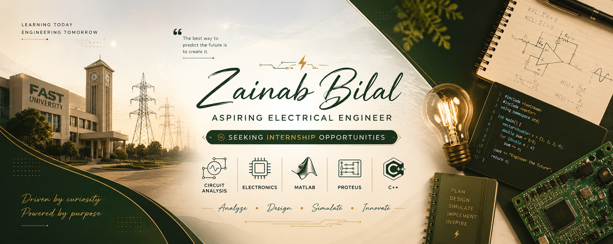
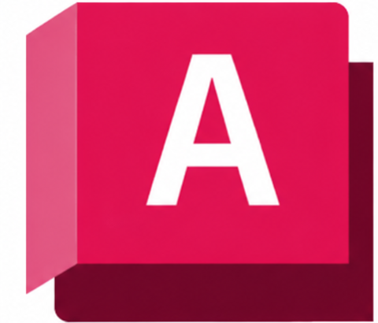
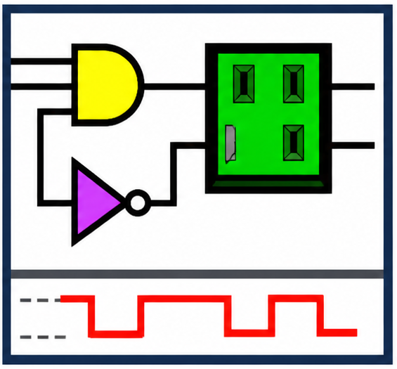

<h1 align="center">Hi 👋, I'm Zainab Bilal</h1>
<h3 align="center">Electrical Engineering Student | Circuit Design • Signal Processing • Embedded Systems</h3>

  

  
  

---

### 🚀 About Me

- 🎓 Electrical Engineering student exploring **signal processing, circuit design, and control systems**
- 🔭 Working across **MATLAB/Simulink, analog & digital circuit design, and embedded C**
- 🌱 Currently deepening my skills in **DSP and automated systems design**
- 👯 Open to collaborating on **electronics, control systems, and engineering software projects**
- 📫 Reach me at: **your-email@example.com**

---

<h3 align="left">🛠️ Languages & Tools</h3>

  <!-- C++ -->
  

  <!-- MATLAB -->
  

  <!-- Simulink -->
  

  <!-- Proteus -->
  

  <!-- AutoCAD -->
  

  

  <!-- LogicWorks -->
  

### 📌 Featured Projects

**⚡ Signal Processing & Control Systems**
- [Discrete Fourier Transform (DFT) & FFT Analysis Using MATLAB](https://github.com/ZainabBilal1234/Discrete-Fourier-Transform-DFT-and-FFT-Analysis-Using-MATLAB)
- [Separately Excited DC Motor Using MATLAB/Simulink](https://github.com/ZainabBilal1234/separately_excited_dc_motor_usingmatlab_simulink)

**🔌 Analog & Digital Circuit Design**
- [Differential Amplifier Design Using Operational Amplifier](https://github.com/ZainabBilal1234/Differential-Amplifier-Design-Using-Operational-Amplifier)
- [Square Wave to Triangular Wave Converter Using Op-Amp](https://github.com/ZainabBilal1234/square_wave_to_triangular_wave_converter_using_op_amp)
- [Resistive Voltage Divider Circuit Using Series & Parallel Resistors](https://github.com/ZainabBilal1234/resistive_voltage_divider_circuit_using_series_and_parallel_resistors)
- [Hybrid Lighting Control Circuit Using 1-Way and 2-Way Switches](https://github.com/ZainabBilal1234/hybrid_lighting_control_circuit_using_1way_and_2way_switches)

**🏭 Smart Systems & Automation**
- [Smart Inventory: Dynamic Order Fulfillment System (SIDOF)](https://github.com/ZainabBilal1234/Smart-Inventory-Dynamic-Order-Fulfillment-System-SIDOF-)
- [Automated Occupancy Management and Priority Access System](https://github.com/ZainabBilal1234/Automated-Occupancy-Management-and-Priority-Access-System)

**📐 Mechanical / CAD Design**
- [Load Bearing Bracket Design Using AutoCAD](https://github.com/ZainabBilal1234/load_bearing_bracket_design_using_autocad-)

**💻 Programming**
- [Number Guessing Game in C](https://github.com/ZainabBilal1234/number_guessing_game_in-C-)

---

### 📊 GitHub Stats

  
  

  

  

---

### 🏆 GitHub Trophies

  

---

### 🌐 Connect With Me

  
  
  

---

  

<i>Thanks for visiting my profile! ⭐ Feel free to explore my repositories.</i>

